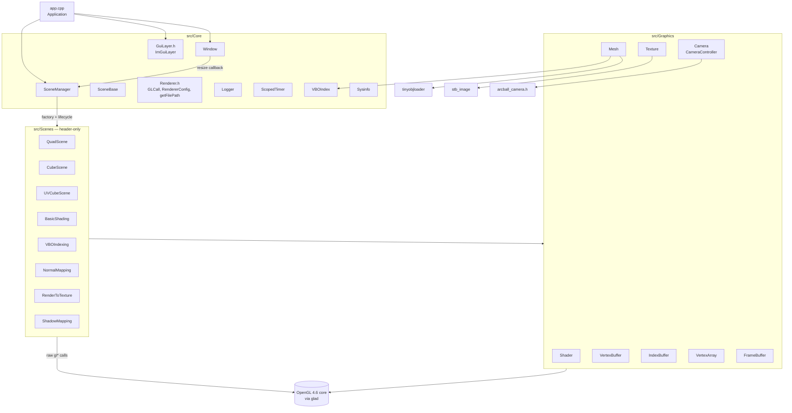
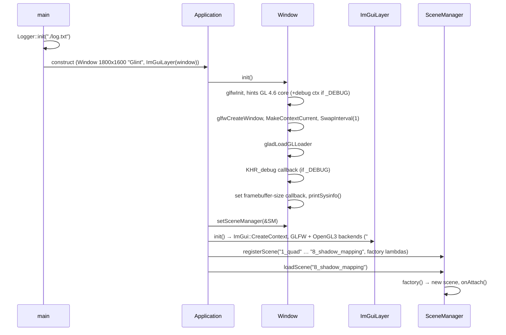
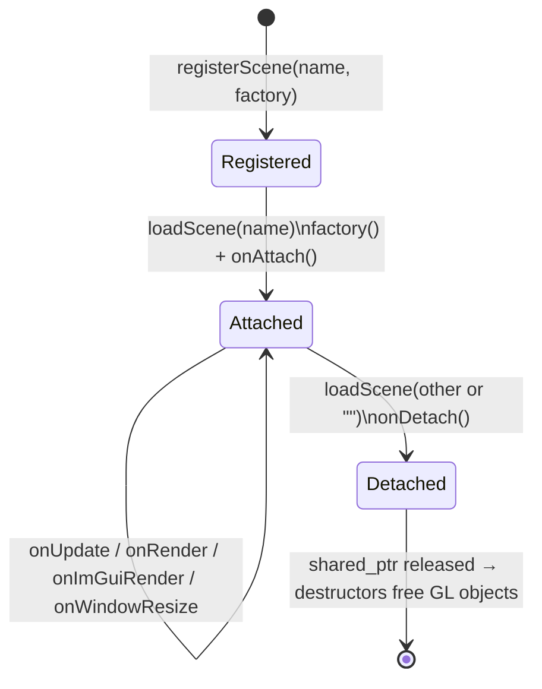

# Architecture

## Layers



- **Core** is the app shell: window and context, the ImGui frame, scene lifecycle, logging, and GL error helpers.
- **Graphics** holds thin wrappers over GL objects plus CPU-side helpers (`Mesh`, `CameraController`).
  They don't hide GL: scenes still call `glVertexAttribPointer`, `glDrawElements`, `glEnable`, and so on directly.
- **Scenes** are the techniques. Each is a single header containing a class derived from `SceneBase`.
  They are only included by `app.cpp`.

Dependencies all point one way (Scenes → Graphics → Core), except that `Graphics/Camera.h` and the
wrappers include `Core/Renderer.h` for `GLCall` and the `unique_ptr` aliases.

## Startup sequence



## Frame loop (`Application::run`)

```
while !window.shouldClose():
    window.pollEvents()                 // ESC → close
    dt = now - last                     // high_resolution_clock, seconds
    imgui.beginFrame()                  // ImGui NewFrame (OpenGL3 + GLFW)
    sceneManager.onUpdate(dt)           // scene logic, camera update
    sceneManager.onRender()             // scene draws; default: clear to dark grey
    sceneManager.onImGuiRender()        // "Scene Control Panel" + scene's own panels
    imgui.endFrame()                    // ImGui::Render + RenderDrawData
    window.swapBuffers()                // vsync on
```

Things to know about this loop:
- **ImGui's frame is open during update and render.** Scenes read `ImGui::GetIO().DisplaySize` as the window
  size and use ImGui's mouse state for camera input. As a result, the camera logic depends on ImGui.
- On the very first frame, `DisplaySize` is still `(-1,-1)` until `NewFrame` runs. The RTT and shadow scenes
  handle this by retrying `setupRtt()` inside `onRender`, which is where the "RTT not initialized yet" log line comes from.
- There is no fixed timestep, no frame pacing beyond vsync, and no GPU timing.

## Scene lifecycle



- Switching scenes **creates a new instance each time**, so scene state such as camera or light settings is not kept.
- GL resources are freed by RAII (`unique_ptr` members). `onDetach()` is mostly used to undo global GL
  state, for example `glDisable(GL_CULL_FACE)`.
- The registry is an `unordered_map`, so the order in the combo box isn't guaranteed. The numeric prefixes
  exist for humans, not for sorting.

## Ownership and lifetimes

| Object | Owner | Lifetime |
|---|---|---|
| `GLFWwindow`, GL context | `Window` (by value in `Application`) | whole app; destructor calls `glfwTerminate` |
| ImGui context | `ImGuiLayer` | whole app (never explicitly shut down) |
| Scene factories | `SceneManager::m_Scenes` | whole app |
| Current scene | `SceneManager::m_CurrentScene` (`shared_ptr`) | until the next `loadScene` |
| GL buffers, textures, FBOs, programs | scene members (`unique_ptr<…>` or by value) | the scene instance |
| `RendererConfig` flags | static globals | whole app |

The GL wrappers have **no copy or move semantics defined**. They are always held in `unique_ptr` or as
non-copied members; copying one would double-delete the GL name.

## GL state model

There is **no state tracking**. OpenGL's global state machine is shared by:
1. `SceneManager::renderingUI()` checkboxes (wireframe, depth test, blend), which call `glEnable`/`glDisable` immediately.
2. Each scene's `onAttach` (e.g. `QuadScene` disables depth test, others enable it) and per-frame calls
   (`ShadowMapping` enables culling each frame).
3. `Renderer::setup3D()` / `setp2D()`, helpers that are only used by `ShadowMapping`.

Consequences: state leaks between scenes, and the UI checkboxes can drift out of sync with the real GL
state. Vertex attribute setup is also redone every frame (`glEnableVertexAttribArray` + `glVertexAttribPointer`
inside `onRender`) instead of being recorded once in the VAO. Each scene creates a VAO, but uses it as a
formality.

### Vertex attribute location convention

Most shaders use this convention:

| location | attribute |
|---|---|
| 0 | position (vec3; vec2 in QuadScene) |
| 1 | UV (vec2), or colour (vec3) in Quad/Cube |
| 2 | normal (vec3) |
| 3 | tangent (vec3) |
| 4 | bitangent (vec3) |

Each attribute has its own buffer (non-interleaved), which is how opengl-tutorial.org does it.

## Paths and resources

- CMake bakes `ROOT="<source dir>"` into the binary. `getFilePath("/shaders/x.vert")` returns `ROOT + path`.
  Shaders and assets are read **from the source tree at runtime**, so shaders can be edited without rebuilding.
  Re-selecting the scene reloads them.
- As a result the binary can't be moved around; it depends on where the source tree is.
- `log.txt` and `imgui.ini` are written to the **current working directory**.

## Logging and error handling

- `Logger` (`Core/Logger.h`) is header-only with static state. Its methods are `log/error(args...)`, which
  stream-concatenate their arguments, and `logf/errorf(fmt, args...)` for `{}`-style formatting.
  Output gets a timestamp and goes to the console and to `log.txt` (append mode), guarded by a mutex.
  It includes `operator<<` for `glm::vec3/vec4/mat4` and a formatter for `ImVec2`.
- `GLCall(x)` (Debug builds only) clears `glGetError`, runs `x`, then logs and `DEBUG_BREAK()`s on error.
- With `_DEBUG` defined, the window requests a debug context and installs the `KHR_debug` callback
  `glDebugOutput` (`Core/Sysinfo.cpp`). It prints source, type and severity to stderr, synchronously, so a
  breakpoint in the callback shows the offending call.
- Failures are handled unevenly: missing OBJ files throw `std::runtime_error`, shader compile errors are only
  logged (the program still gets used), and a missing texture file isn't checked at all. See
  [known-issues.md](known-issues.md).

## Third-party code (`ext/`)

| Library | Used by | Notes |
|---|---|---|
| glad (GL 4.6, **compatibility** profile loader) | everything | context is core; loader includes compat entry points |
| GLFW 3.4 (Windows prebuilt) / system GLFW ≥ 3.3 (Linux) | `Window`, ImGui backend | |
| GLM (git submodule) | everywhere | default GL clip conventions (`[-1,1]` depth) |
| Dear ImGui 1.91.9 (+ GLFW, OpenGL3 backends) | `ImGuiLayer`, scenes | not the docking branch |
| stb_image / stb_image_write | `Texture` | images flipped vertically on load |
| tinyobjloader | `Mesh` | triangulated OBJ; materials ignored |
| arcball_camera.h | `CameraController` | single-header, implementation in `Camera.cpp` |
| boost/ut.hpp | `tests/` | tests are not wired into CMake |
